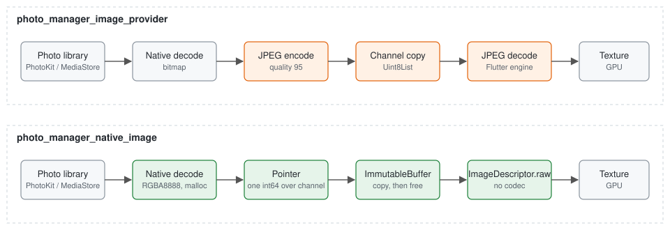
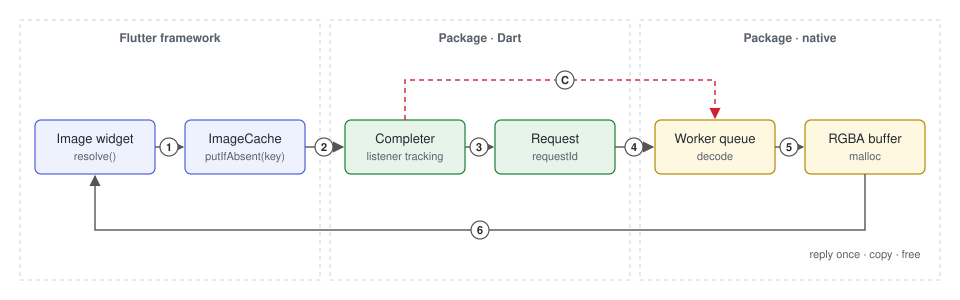
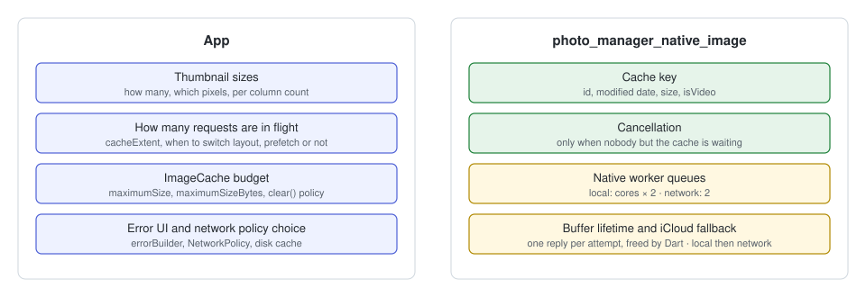

# photo_manager_native_image

Load `photo_manager` thumbnails as **native RGBA pixels**. The platform decodes
the asset, hands Flutter a `malloc` pointer, and Flutter uploads the pixels
through `ImageDescriptor.raw`. No JPEG is encoded or decoded between the photo
library and the screen.

```dart
// size is the pixel length of the shorter side. Which sizes an app uses,
// and how many, is the app's decision.
Image(image: NativeImageProvider(asset, size: 320), fit: BoxFit.cover);

// Or the convenience widget.
NativeAssetImage(
  asset,
  size: 320,
  errorBuilder: (context, error, _) {
    if (error is NativeImageException &&
        error.code == NativeImageErrorCode.icloudNotDownloaded) {
      return const Icon(Icons.cloud_download);
    }
    return const Icon(Icons.broken_image);
  },
);
```

| | Android | iOS |
|---|---|---|
| Source | `ContentResolver.loadThumbnail` (≤ 768 px), `ImageDecoder` above; `MediaStore.*.Thumbnails` + `BitmapFactory` with orientation fix on API 26–28 | `PHImageManager.requestImage(.aspectFill, .highQualityFormat, .fast)` on a worker queue, `vImage` downscale |
| Pixels handed over | `ARGB_8888` → JNI `malloc` | RGBA8888 → `malloc` |
| JPEG round trips | **0** | **0** |
| Extra framework | none | `Photos`, `Accelerate` |
| Minimum OS | API 26 | iOS 13 |

## How it differs from `photo_manager_image_provider`



`AssetEntityImageProvider` asks `photo_manager` for thumbnail *bytes*. The
platform decodes the asset, re-encodes it as JPEG (quality 95 on iOS), copies
the bytes across the method channel, and Flutter decodes the JPEG again. For a
grid that is two decodes and two copies per cell, and the request cannot be
cancelled once it has been sent.

This package keeps the pixels native. The platform decodes once, straight to
premultiplied RGBA, and sends back four integers: pointer, width, height, row
bytes. Dart copies the buffer into an `ImmutableBuffer`, frees the pointer, and
builds the image from the raw descriptor. There is no codec on the Dart side.

| | `AssetEntityImageProvider` | `NativeImageProvider` |
|---|---|---|
| Wire format | JPEG / PNG bytes | pointer to RGBA |
| Decodes | 2 (native + Dart) | 1 (native) |
| Copies | 2 (channel + engine) | 1 (`ImmutableBuffer`) |
| Cancellation | none | before the buffer is allocated |
| Sizing | `ThumbnailSize(width, height)` box | `size` = shorter side |
| Cache key | id, size, format, original flag | id, modified date, size, isVideo |
| Errors | `StateError` / platform message | `NativeImageException(code)` |
| iCloud | downloads inline, blocking the request | local first, then one low-priority network attempt (`NetworkPolicy`) |

Both providers are plain `ImageProvider`s and can coexist in one app.

## Request lifecycle



1. An `Image` widget resolves the provider. The key is the provider itself:
   `(entity.id, modifiedDateSecond ?? createDateSecond, size, isVideo)`.
2. `ImageCache.putIfAbsent` finds no entry and asks the provider for a
   completer. The cache attaches its own listener first; the widget's listener
   is attached right after. The completer remembers which one is the cache's.
3. The completer starts a request with a fresh `requestId` and sends it over
   the Pigeon channel.
4. The platform puts the request on a worker queue. Nothing blocks the platform
   thread.
5. A worker decodes, converts to RGBA, and allocates a `malloc` buffer. From
   this point the request cannot be cancelled: the buffer is Dart's to free.
6. The platform replies exactly once. Dart copies the buffer into an
   `ImmutableBuffer`, frees the pointer on every path (success, cancel, error),
   and hands the frame to the completer. `ImageCache` keeps it; the widget
   paints it.

**C — cancellation.** When the completer's last *widget* listener leaves and
no image has arrived, it sends `cancelRequest(requestId)` and evicts the key
from `ImageCache`. On the platform, a request that has not reached step 5 is
dropped and replies `null`; one that has already allocated still replies with
the buffer, which Dart frees and discards.

Two situations look like "the last listener left" but are not:

- `imageCache.clear()` (memory pressure) detaches only the cache's listener.
  The widget is still on screen, so the request keeps going.
- A cache listener that detaches synchronously inside `addListener` (the
  completer already had an image) never counted as a waiter.

The completer tells these apart because it locked in the first listener as the
cache's in step 2. `imageCache.clear()` therefore never produces a blank cell,
and a scrolled-away cell always stops its native work.

## Who owns what



The package owns everything between "this key needs pixels" and "here is a
frame". The app owns every policy decision above that.

| Concern | Owner | Notes |
|---|---|---|
| Which pixel sizes exist | App | e.g. 128 for dense grids, 320 for 2–6 columns. Pass the number; the package does not define tiers. |
| How many requests are in flight | App | Driven by `cacheExtent`, layout changes during a pinch, prefetching. The package queues whatever it is asked and cancels what stops being needed; it does not throttle. |
| `ImageCache` budget and `clear()` policy | App | The package uses the app's `PaintingBinding.imageCache` and nothing else. No second cache, no disk cache. |
| Error UI | App | `errorBuilder` receives `NativeImageException`. |
| iCloud fallback | Package | `NetworkPolicy.fallback` (default): local first, then one network attempt on the low-priority queue. The app only picks the policy. |
| Cache key | Package | Edited assets get a new key through the modified date. The network policy is *not* part of the key, so the fallback attempt fills the same slot. |
| Cancellation | Package | Listener tracking in the completer, `cancelRequest` on the channel, `evict(key)` so the next resolve starts fresh. A failed load is evicted too, like `NetworkImage`. |
| Native worker queues | Package | iOS: `OperationQueue` at `userInitiated`, cores × 2; a second queue at `utility` with 2 slots for network attempts. Android: fixed pool of cores / 2 + 1. |
| Buffer lifetime | Package | Exactly one reply per request, tracked by a `done` flag. Dart frees on every path. No finalizer, so no double free. |
| Photo daemon reconnect (iOS) | Package | An XPC interruption evicts the cached `PHAsset` and retries once. |

If a number in the "Native worker queues" row feels wrong for your app, that is
a sign the app is sending too many requests, not that the queue needs a knob.
The example app's `maxInflight` counter shows the depth the app reached.

## Sizing

`size` is the pixel length of the **shorter** side after aspect-fill, so a
320 request for a 4:3 photo yields about 427 × 320. The platform never
upscales. If it returns something larger than asked (PhotoKit's `.fast`
resize can), Dart scales it down once through `instantiateCodec`.

For a square grid cell, ask for the cell's pixel size and draw with
`BoxFit.cover`. For a dense grid a smaller size over a shared base layer is
cheaper than one size per column count, because the key never changes during
a pinch.

## Errors

`errorBuilder` receives a `NativeImageException` with a typed
`NativeImageErrorCode`:

| Code | Meaning | Typical handling |
|---|---|---|
| `notFound` | The asset no longer exists | Drop the cell, refresh the album |
| `icloudNotDownloaded` | iOS only: the asset is in iCloud and the policy did not allow a download, or the download attempt did not succeed | Show a cloud placeholder |
| `decodeFailed` | The platform could not produce pixels | Broken-image placeholder |

A failed key is evicted from `ImageCache`, so the next resolve of the same
provider sends a new request.

## Instrumentation

`NativeImageMetrics.instance` (a `ChangeNotifier`) counts requests,
completions, cancels, failures, in-flight depth, request-to-frame latency
samples, and live native buffers. `liveBuffers` must read 0 whenever the app is
idle; anything else is a leak. The example app shows all of these in a panel
and has a button that forces `PaintingBinding.handleMemoryPressure()` so the
cancellation rules can be checked on a device.

## iCloud (iOS)

`NetworkPolicy` decides whether PhotoKit may download:

| Policy | Behaviour | Use for |
|---|---|---|
| `fallback` (default) | Local first. If the asset is iCloud-only, one more request is sent with network access on the low-priority queue (two slots). The frame fills the same cache key; if that attempt fails too, its error is reported. | Grids and lists |
| `never` | Local only; iCloud-only assets fail with `icloudNotDownloaded`. | Offline modes, data-saver settings |
| `always` | Network from the first request. Every request goes through the two-slot download queue, so a grid built with it will crawl. | Detail views |

On Android the policy is ignored; MediaStore assets are always local.

## Requirements

- Android `minSdkVersion 26`, iOS 13.
- Call `PhotoManager.requestPermissionExtend()` before loading; the package
  does not request permission.
- CocoaPods and Swift Package Manager are both supported on iOS
  (`darwin/` podspec and `Package.swift`).

## Not in scope

Disk caching, prefetching, cache partitioning, resolution tiers, and
`photo_manager_image_provider` compatibility shims. Those belong to the app.

## License

Apache-2.0.
