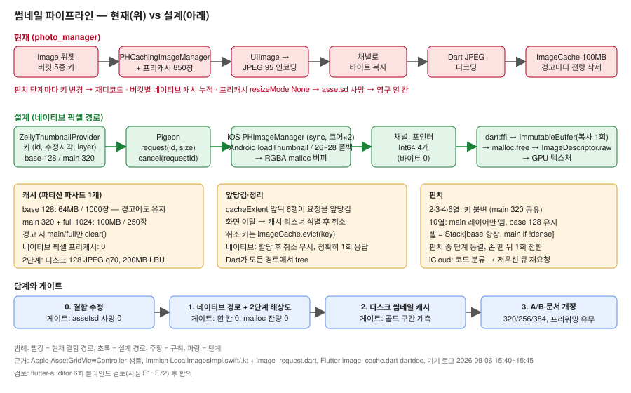

# 갤러리 썸네일 파이프라인 — 설계 계약 (2026-09-06, 6차 검토 합의)

**목표:** 업로드 그리드·뷰어에서 핀치줌·스크롤 중 흰 칸 0, 메모리 경고 0을 목표로, OS 갤러리와 구분되지 않는 속도.
**기준:** 구현 난이도 무관, 성능 최우선. 네이티브 채널 경로 포함.

## 원칙 (위반하면 그 작업은 폐기)

| # | 원칙 | 한 줄 이유 |
|---|---|---|
| P1 | **한 자산에 해상도 두 단계뿐** — base 128(밑그림·10열·캐러셀·영상 포스터), main 320(2~6열). 핀치는 캐시 키를 바꾸지 않는다 | iOS 사진앱·Immich 모두 한 해상도. 버킷 5종이 재디코드·다중 캐시의 뿌리였다 |
| P2 | **픽셀은 네이티브가 RGBA로 디코드해 포인터만 넘긴다** (Pigeon + `dart:ffi` + `ImageDescriptor.raw`). PhotoKit/MediaStore 경로에서 JPEG 인코딩·디코딩 0회 | photo_manager의 JPEG 왕복은 구조가 강제한 비용이지 필수가 아니다 |
| P3 | **네이티브 픽셀 프리캐시 0.** 앞당김은 Flutter `cacheExtent`(앞뒤 6행)가, 정리는 **취소**가 맡는다 | `startCachingImages` 창이 `assetsd`를 죽였다. Immich는 프리캐시를 쓰지 않는다 |
| P4 | **취소는 캐시 리스너를 식별한 뒤** 판단하고, 취소한 키는 `imageCache.evict(key)`로 pending에서 뺀다 | 순진한 `onLastListenerRemoved`는 메모리 경고·`putIfAbsent` 동기 detach에서 오작동 |
| P5 | **버퍼 소유권은 Dart.** 네이티브는 할당 뒤엔 취소를 보지 않고 **정확히 1회** 응답, Dart가 모든 경로에서 free | 이중 응답 = Android 크래시·iOS 누수. 무응답 = 영구 빈 칸 |
| P6 | **Flutter 이미지 캐시는 파티션 파사드 1개** — base 64MB/1000장, main+full 100MB/250장. 메모리 경고는 main/full만 비운다 | 320·1024가 128 밑그림을 밀어내면 흰 칸이 돌아온다 |
| P7 | **그리드는 `isNetworkAccessAllowed=false`.** iCloud 미다운로드는 에러 코드로 분류해 저우선 큐(동시 2)에서 1회 재요청 | 동기 요청이 다운로드 동안 워커 큐를 통째로 막는다 |
| P8 | **게이트는 실기기 계측으로만 닫는다** | 추정치로 통과 처리하지 않는다 |

## 최종 상태 (Definition of Done)

- 10↔2 핀치 왕복 10회: 흰 칸 0, 셀 Element 재생성 0(`upload_grid_section_test.dart:521` 유지), `assetsd` 재연결 0, 취소 후 `malloc` 잔량 0, 요청→프레임 지연 p50/p95·큐 대기 최대치·16ms 초과 프레임 수 기록.
- 픽셀 패스 ≤ 4회(API 26~28은 회전 보정으로 ≤ 5회) — 코드 검사.
- `AssetEntityImageProvider`·`GalleryThumbnailService`·`PhotoCachingManager` 사용처 0.
- API 26 에뮬레이터: 그리드가 그려지고 세로 사진이 바로 서 있다.
- 320 vs 256 vs 384, 128 밑그림 프리워밍 유무 A/B 결과가 계측 로그로 남는다.

## 단계

| 단계 | 내용 | 게이트 |
|---|---|---|
| 0 | **결함 수정(설계와 독립, 즉시)**: 프리캐시 `resizeMode None` → `.ios(fast)`, 프리페치 post-frame, 서비스 단일 인스턴스, 줌아웃 페이징을 핀치 끝으로 | 기기: 핀치 왕복 중 `assetsd` 사망 0 |
| 1 | 네이티브 픽셀 경로(P2·P4·P5·P7) + 두 단계 해상도(P1) + 프리캐시 삭제(P3) + 파티션 캐시(P6) + 10열 compact UI | DoD 1·2·3 |
| 2 | 앱 전용 디스크 썸네일 캐시(base 128, JPEG q70, 200MB LRU, 키 `id_modifiedDateSecond_128`) | 첫 진입·앨범 전환 콜드 구간 계측 |
| 3 | A/B 확정(해상도·프리워밍), 문서 개정 | DoD 4 |

## 수용한 리스크

- 엔진 detach·isolate 종료 시 in-flight 버퍼 누수(동시 요청 수 × ≤400KB). 핫리스타트 한정.
- 2열에서 320→585px 업스케일 1.8배(Immich 프로덕션 수치). A/B로 재확인.
- 핫리로드의 `PaintingBinding.evict`는 base 파티션을 비우지 않는다(디버그 한정).

## 상세 문서

| 문서 | 내용 |
|---|---|
| [리서치](./thumbnail-pipeline-research.md) | iOS 사진앱·Android·Immich·photo_manager 비교와 근거 |
| [작업 체크리스트](./thumbnail-pipeline-checklist.md) | 단계별 `- [ ]` 작업, 파일, 함정(F1~F72 반영) |
| [변경 이력](./thumbnail-pipeline-history.md) | v1~v6에서 폐기한 안과 이유 |
