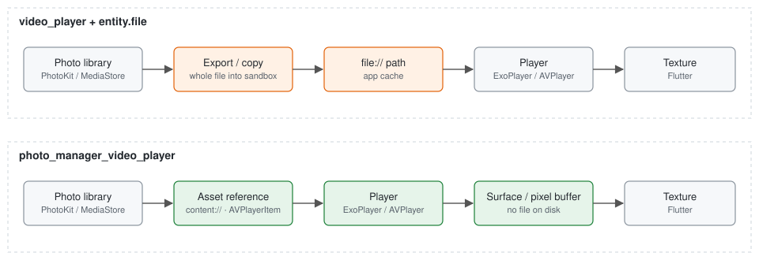
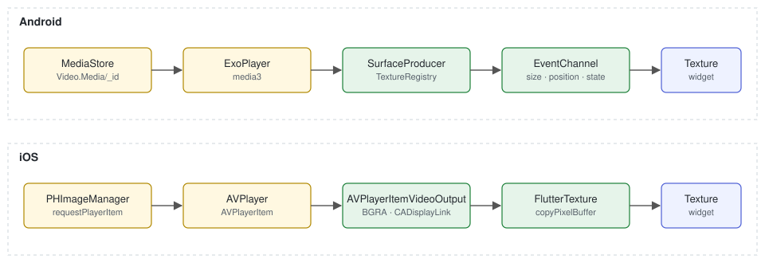
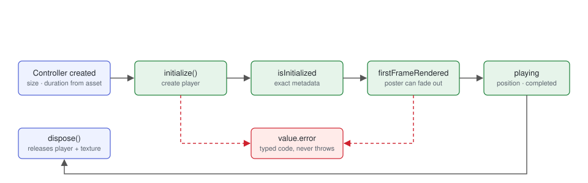

# photo_manager_video_player

Play `photo_manager` gallery videos **without copying the original**. Android
hands ExoPlayer the MediaStore `content://` URI; iOS asks PhotoKit for an
`AVPlayerItem`. Neither path exports, transcodes, or copies a file, so a
gallery video starts as fast as the system Photos app.

```dart
final controller = AssetEntityVideoController(asset);
await controller.initialize();
await controller.play();

AspectRatio(
  aspectRatio: controller.value.aspectRatio,
  child: AssetEntityVideoView(controller),
);
```

| | Android | iOS |
|---|---|---|
| Resolve | `MediaStore.Video.Media` `content://` URI | `PHImageManager.requestPlayerItem` |
| Play | ExoPlayer (media3) | `AVPlayer(playerItem:)` |
| Draw | `TextureRegistry.SurfaceProducer` | `AVPlayerItemVideoOutput` → `FlutterTexture` |
| Bytes copied | **0** | **0** |
| Extra framework | media3-exoplayer | `Photos`, `AVFoundation` |
| Minimum OS | API 21 | iOS 13 |

## How it differs from `video_player`



`video_player` plays files and URLs. To play a gallery asset with it, an app
first calls `entity.file`, which on Android copies the whole original into the
app cache and on iOS runs an `AVAssetExportSession`. For a 4K clip that copy
takes seconds and doubles the storage the video occupies, and it happens
before the first frame can appear. In a swipeable gallery, the copy *is* the
latency.

This package skips the file. The platform player is pointed straight at the
library's own reference to the asset, and frames are drawn into a Flutter
texture the same way `video_player` draws them.

| | `video_player` + `entity.file` | `photo_manager_video_player` |
|---|---|---|
| Input | file path or URL | `AssetEntity` |
| Disk writes before first frame | full copy / export | none |
| Time to first frame | copy time + decoder spin-up | decoder spin-up |
| iCloud-only asset (iOS) | export fails or blocks | streams while downloading, with `downloadProgress` |
| Layout before metadata | unknown until initialized | seeded from `AssetEntity` size and duration |
| Errors | thrown from `initialize()` | typed `value.error`, never thrown |
| Network URLs, captions, DRM, PiP | yes | not in scope |

Both can live in one app: keep `video_player` for remote streams and use this
package for anything that comes from the photo library.

## How frames reach the screen



**Android.** The asset id is a MediaStore `_ID`; it becomes
`content://media/external/video/media/<id>` and is given to ExoPlayer as a
`MediaItem`. ExoPlayer renders into the `Surface` of a
`TextureRegistry.SurfaceProducer`, which is the Flutter texture. Playback
state, video size, position, and first-frame events are forwarded on an
`EventChannel` from ExoPlayer's listener.

**iOS.** The asset id is a `PHAsset.localIdentifier`. `requestPlayerItem` returns
an `AVPlayerItem` that plays the library file in place (or streams it from
iCloud when `allowNetworkAccess` is true). An `AVPlayerItemVideoOutput`
configured for 32-bit BGRA is attached to the item; a `CADisplayLink` polls it
once per display refresh and, when a new frame exists, marks the Flutter
texture dirty. Flutter then calls `copyPixelBuffer`, which hands over the
latest `CVPixelBuffer` without copying its bytes.

On both platforms the video surface belongs to the player until `dispose()`,
and orientation metadata is reported as `rotationDegrees` so
`AssetEntityVideoView` can rotate the texture instead of the player
re-encoding anything.

## Controller lifecycle



`AssetEntityVideoController` is a `ValueNotifier<AssetEntityVideoValue>`.

1. **Created.** `value.size` and `value.duration` are seeded from the
   `AssetEntity`, so `AspectRatio` lays out correctly before any native work
   has started. Nothing is allocated yet.
2. **`initialize()`.** Creates the platform player and a texture. Returns when
   the player has reported its metadata; `size` and `duration` are now exact.
   Calling it twice returns the same future. `play()`, `pause()`, `seekTo()`
   initialize on demand, so calling `initialize()` yourself is optional.
3. **`firstFrameRendered`.** The texture has real pixels. This is the moment
   to fade out a poster thumbnail; before it the texture is transparent.
4. **Playing.** `position` updates while playing; `isCompleted` is set when
   playback reaches the end and cleared by the next `play()`.
5. **`dispose()`.** Releases the player, the texture, and the event
   subscription. A controller that is disposed while `initialize()` is still
   in flight disposes the player as soon as it is created.

Any failure lands in `value.error` with a typed `AssetEntityVideoErrorCode`
and stops playback. Nothing in this package throws into the widget tree: one
broken asset must not break a gallery swipe.

`prepare()` is `initialize()` under a name that says what it is for: warming
up the decoder of a neighbouring asset before the user swipes to it.

### `AssetEntityVideoValue`

| Field | Meaning |
|---|---|
| `size`, `aspectRatio`, `rotationDegrees` | Frame geometry. Seeded from the asset, corrected from the player |
| `duration`, `position` | Same |
| `isInitialized` | Player reported metadata |
| `firstFrameRendered` | Texture holds a real frame |
| `isPlaying`, `isBuffering`, `isCompleted`, `isLooping`, `volume` | Playback state |
| `downloadProgress` | iOS only, 0–1 while an iCloud asset streams in; `null` otherwise |
| `error` | `AssetEntityVideoError(code, message)` or `null` |

## Who owns what

| Concern | Owner | Notes |
|---|---|---|
| How many players are alive | App | Devices allow only a handful of hardware decoders. Keep the visible one plus at most a neighbour or two; dispose the rest. |
| Poster and cross-fade | App | Show a thumbnail until `firstFrameRendered`. |
| Controls, scrubbing UI, mute policy | App | The controller exposes `play`, `pause`, `seekTo`, `setVolume`, `setLooping`; drawing controls is the app's job. |
| Error UI | App | Switch on `value.error?.code`. |
| Asset resolution | Package | MediaStore URI on Android, `PHAsset` lookup on iOS. |
| Player and texture lifetime | Package | One player per controller; both freed in `dispose()` and on engine detach. |
| Hot restart | Package | The engine survives a hot restart but the Dart side does not, so the first `create` after a restart asks the platform to drop every player from the previous isolate. |
| Event delivery | Package | One `EventChannel` per player; malformed events are ignored rather than thrown. |

## Errors

| Code | Meaning |
|---|---|
| `assetNotFound` | The id no longer resolves to an asset |
| `permissionDenied` | Photo library access is missing |
| `iCloudUnavailable` | iOS: the asset is in iCloud and `allowNetworkAccess` is false, or the download failed |
| `notAVideo` | The `AssetEntity` is not a video |
| `playbackFailed` | The platform player reported an error |

## iCloud (iOS)

With `allowNetworkAccess: true` (the default) PhotoKit streams an iCloud-only
video while it downloads; `downloadProgress` reports 0–1 until
`isInitialized`. Set it to false to fail fast with `iCloudUnavailable`
instead, for example in a grid where downloads should be opt-in.

## Requirements

- Android `minSdkVersion 21`, iOS 13.
- Call `PhotoManager.requestPermissionExtend()` before creating a controller;
  the package does not request permission.
- CocoaPods and Swift Package Manager are both supported on iOS.

## Not in scope

Picture-in-picture, captions, DRM, casting, network URL playback (that is
`video_player`'s job), and macOS.

## License

Apache-2.0.
