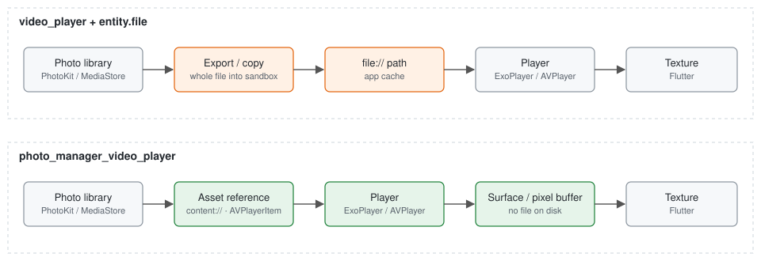
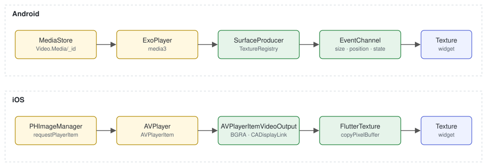
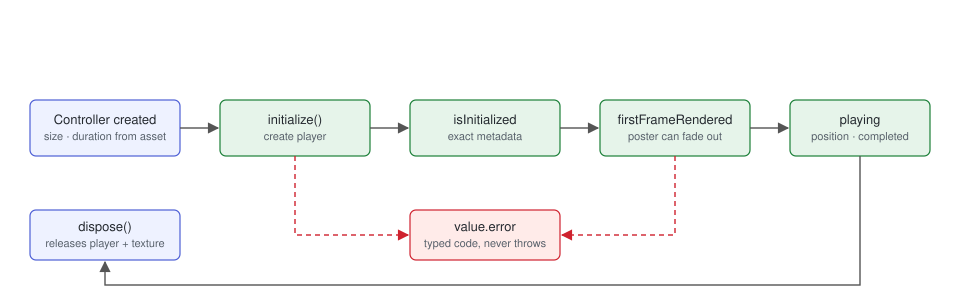

# photo_manager_video_player

Play `photo_manager` gallery videos **without an app-managed copy or export**.
Android hands ExoPlayer the MediaStore `content://` URI; iOS asks PhotoKit for
an `AVPlayerItem`. The app never writes the video to its own storage before
playing it. PhotoKit may still download or prepare the asset itself, for
example when the original is only in iCloud.

```dart
final controller = AssetEntityVideoController(asset);
await controller.initialize();
await controller.play();

AspectRatio(
  aspectRatio: controller.value.aspectRatio,
  child: AssetEntityVideoView(controller),
);
```

| | Android | iOS |
|---|---|---|
| Resolve | `MediaStore.Video.Media` `content://` URI | `PHImageManager.requestPlayerItem` |
| Play | ExoPlayer (media3) | `AVPlayer(playerItem:)` |
| Draw | `TextureRegistry.SurfaceProducer` | `AVPlayerItemVideoOutput` → `FlutterTexture` |
| App-side copy or export | none | none |
| Extra framework | media3-exoplayer | `Photos`, `AVFoundation` |
| Minimum OS | API 21 | iOS 13 |

## How it differs from `video_player`



`video_player` plays files and URLs. To play a gallery asset with it, an app
first calls `entity.file`, which on Android copies the whole original into the
app cache and on iOS runs an `AVAssetExportSession`. For a 4K clip that copy
takes seconds and doubles the storage the video occupies, and it happens
before the first frame can appear. In a swipeable gallery, the copy *is* the
latency.

This package skips the file. The platform player is pointed straight at the
library's own reference to the asset, and frames are drawn into a Flutter
texture the same way `video_player` draws them.

| | `video_player` + `entity.file` | `photo_manager_video_player` |
|---|---|---|
| Input | file path or URL | `AssetEntity` |
| Disk writes before first frame | full copy / export | none |
| Time to first frame | copy time + decoder spin-up | decoder spin-up |
| iCloud-only asset (iOS) | export fails or blocks | streams while downloading, with `downloadProgress` |
| Layout before metadata | unknown until initialized | seeded from `AssetEntity` size and duration |
| Errors | thrown from `initialize()` | typed `value.error`, never thrown |
| Network URLs, captions, DRM, PiP | yes | not in scope |

Both can live in one app: keep `video_player` for remote streams and use this
package for anything that comes from the photo library.

## How frames reach the screen



**Android.** The asset id is a MediaStore `_ID`; it becomes
`content://media/external/video/media/<id>` and is given to ExoPlayer as a
`MediaItem`. ExoPlayer renders into the `Surface` of a
`TextureRegistry.SurfaceProducer`, which is the Flutter texture. Playback
state, video size, position, and first-frame events are forwarded on an
`EventChannel` from ExoPlayer's listener.

**iOS.** The asset id is a `PHAsset.localIdentifier`. `requestPlayerItem` returns
an `AVPlayerItem` that plays the library file in place (or streams it from
iCloud when `allowNetworkAccess` is true). An `AVPlayerItemVideoOutput`
configured for 32-bit BGRA is attached to the item; a `CADisplayLink` polls it
once per display refresh and, when a new frame exists, marks the Flutter
texture dirty. Flutter then calls `copyPixelBuffer`, which hands over the
latest `CVPixelBuffer` without copying its bytes.

On both platforms the video surface belongs to the player until `dispose()`.
When the texture path does not apply the orientation metadata itself, the
quarter turn is reported as `rotationCorrection` and `AssetEntityVideoView`
rotates the texture, so nothing is re-encoded. To draw the video yourself,
use `controller.textureId` in a `Texture` widget with the same rotation.

## Controller lifecycle



`AssetEntityVideoController` is a `ValueNotifier<AssetEntityVideoValue>`.

1. **Created.** `value.size` and `value.duration` are seeded from the
   `AssetEntity`, so `AspectRatio` lays out correctly before any native work
   has started. Nothing is allocated yet.
2. **`initialize()`.** Creates the platform player and a texture. Returns when
   the player has reported its metadata; `size` and `duration` are now exact.
   Calling it twice returns the same future. `play()` initializes on demand.
   Before initialization `setVolume()` and `setLooping()` only store the
   value, which is applied when the player is created; `pause()` cancels a
   pending `play()`, and `seekTo()` does nothing.
3. **`firstFrameRendered`.** The texture has real pixels. This is the moment
   to fade out a poster thumbnail; before it the texture is transparent.
4. **Playing.** `position` updates while playing; `isCompleted` is set when
   playback reaches the end and cleared by the next `play()`. `seekTo()` is
   clamped to `0`–`duration`.
5. **`dispose()`.** Releases the player, the texture, and the event
   subscription, and completes once the platform player is gone. A controller that is disposed while `initialize()` is still
   in flight disposes the player as soon as it is created.

Any failure lands in `value.error` with a typed `AssetEntityVideoErrorCode`
and stops playback. `initialize()` never throws, so a gallery can warm up a
neighbouring page without awaiting it; check `value.hasError` after awaiting.
The one exception is a programming error: passing a non-video `AssetEntity`
to the constructor throws an `ArgumentError`.

### `AssetEntityVideoValue`

| Field | Meaning |
|---|---|
| `size`, `aspectRatio` | Upright frame geometry. Seeded from the asset, corrected from the player |
| `rotationCorrection` | Clockwise quarter turn the raw texture needs; only for drawing `textureId` yourself |
| `duration`, `position` | Same |
| `isInitialized` | Player reported metadata |
| `firstFrameRendered` | Texture holds a real frame |
| `isPlaying`, `isBuffering`, `isCompleted`, `isLooping`, `volume` | Playback state |
| `downloadProgress` | iOS only, 0–1 while an iCloud asset streams in; `null` otherwise |
| `error` | `AssetEntityVideoError(code, message)` or `null` |

## Who owns what

| Concern | Owner | Notes |
|---|---|---|
| How many players are alive | App | Devices allow only a handful of hardware decoders. Keep the visible one plus at most a neighbour or two; dispose the rest. |
| Poster and cross-fade | App | Show a thumbnail until `firstFrameRendered`. |
| Controls, scrubbing UI, mute policy | App | The controller exposes `play`, `pause`, `seekTo`, `setVolume`, `setLooping`; drawing controls is the app's job. |
| Error UI | App | Switch on `value.error?.code`. |
| Audio session and focus | Package, minimal | Android: an audible player takes audio focus, so other audio pauses; a muted player (volume 0) does not. iOS raises the default `.soloAmbient` session to `.playback` once, on the first player, so the silent switch does not mute video; any category the app set is kept. With that default, starting any player on iOS, muted or not, stops other apps' audio, as with `video_player`; an app whose muted previews must not do that sets `.ambient` or `.mixWithOthers` itself. Mixing with other audio, ducking and Now Playing are the app's. |
| App lifecycle | Package | Playback pauses when the app goes to the background and resumes on return if it was playing. Background playback is not offered. |
| Audio interruptions (calls, other apps) | App | The system pauses playback and `isPlaying` turns false; resuming afterwards is the app's decision. |
| Asset resolution | Package | MediaStore URI on Android, `PHAsset` lookup on iOS. |
| Player and texture lifetime | Package | One player per controller; both freed in `dispose()` and on engine detach. |
| Hot restart | Package | The engine survives a hot restart but the Dart side does not, so the first `create` after a restart asks the platform to drop every player from the previous isolate. |
| Event delivery | Package | One `EventChannel` per player; malformed events are ignored rather than thrown. |

## Frames without a copy

`AssetEntityVideoFrames.extract` returns JPEG stills for a list of times — for
thumbnail strips, or to hand a few frames to an image model — through the
same zero-copy resolution as playback.

```dart
final List<Uint8List?> frames = await AssetEntityVideoFrames.extract(
  assetId: asset.id,
  timesMs: <int>[0, 2000, 4000],
  maxEdge: 480,   // longer edge, in pixels
  quality: 70,    // JPEG quality, 0–100
);
```

| | Android | iOS |
|---|---|---|
| Resolve | `MediaStore.Video.Media` `content://` URI | `PHImageManager.requestAVAsset` |
| Decode | `MediaMetadataRetriever.getScaledFrameAtTime` (`getFrameAtTime` + scale below API 27) | `AVAssetImageGenerator`, preferred track transform applied |
| Bytes copied | **0** | **0** |

- The asset is opened once per call, whatever the number of times.
- The result has one entry per time, in order; a frame that fails is `null`.
- Frames snap to the nearest sync frame: fast, but not frame-exact.
- `allowNetworkAccess` defaults to **false** here. An iCloud-only video then
  throws a `PlatformException` with code `iCloudUnavailable` instead of
  downloading. Android ignores the flag.
- Only a failure to open the asset throws; its code is one of the names in
  [Errors](#errors).

## Errors

| Code | Meaning |
|---|---|
| `assetNotFound` | The id no longer resolves to an asset, or the asset is outside a limited (selected-photos) grant |
| `permissionDenied` | The app has no photo library access at all |
| `iCloudUnavailable` | iOS: the asset is in iCloud and `allowNetworkAccess` is false, or the download failed |
| `playbackFailed` | The platform player reported an error |

## iCloud (iOS)

With `allowNetworkAccess: true` (the default) PhotoKit streams an iCloud-only
video while it downloads; `downloadProgress` reports 0–1 until
`isInitialized`. Set it to false to fail fast with `iCloudUnavailable`
instead, for example in a grid where downloads should be opt-in.

## Requirements

| | Declared minimum | Tested on |
|---|---|---|
| Flutter / Dart | 3.29 / 3.3 | 3.44 |
| Android | API 21 (media3-exoplayer 1.4.1) | API 28 and 36 emulators, Galaxy S21 (Android 15) |
| iOS | 13 | iOS 26.2 simulator, iPhone 14 (iOS 26) |

- Call `PhotoManager.requestPermissionExtend()` before creating a controller;
  the package does not request permission.
- CocoaPods and Swift Package Manager are both supported on iOS.

## Not in scope

Network URL playback (that is `video_player`'s job), picture-in-picture, DRM,
casting, and macOS. Playback speed, buffered ranges, captions, mixing with
other audio and background playback are not in this version. A display
matrix that mirrors the picture is drawn without the mirroring.

## License

Apache-2.0.
